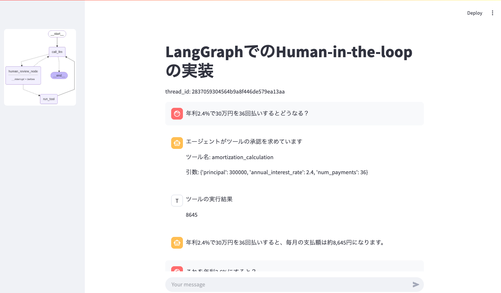

# human-in-the-loop3

LangGraphのHuman in the Loopの実装です。
StudyCoの勉強会の内容を写経したうえで、ツール部分の実装をファイナンス系の計算に変更しています。


##　起動方法

```bash
uv run streamlit run app.py
```

## 画面操作イメージ

```bash
年利2.4%で30万円を36回払いするとどうなる？
```


