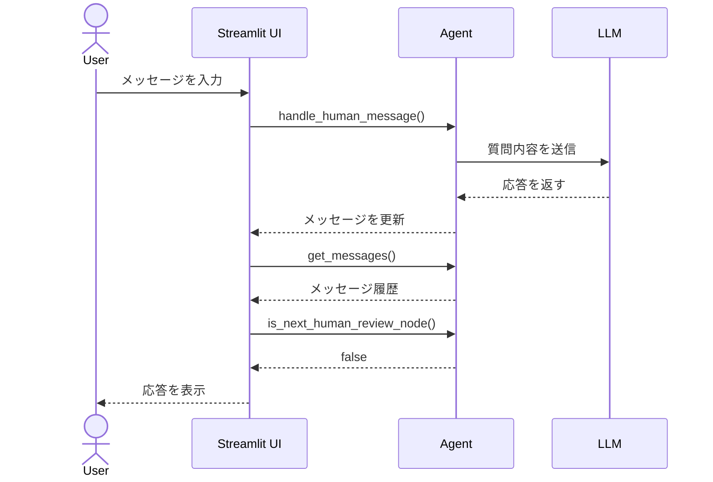
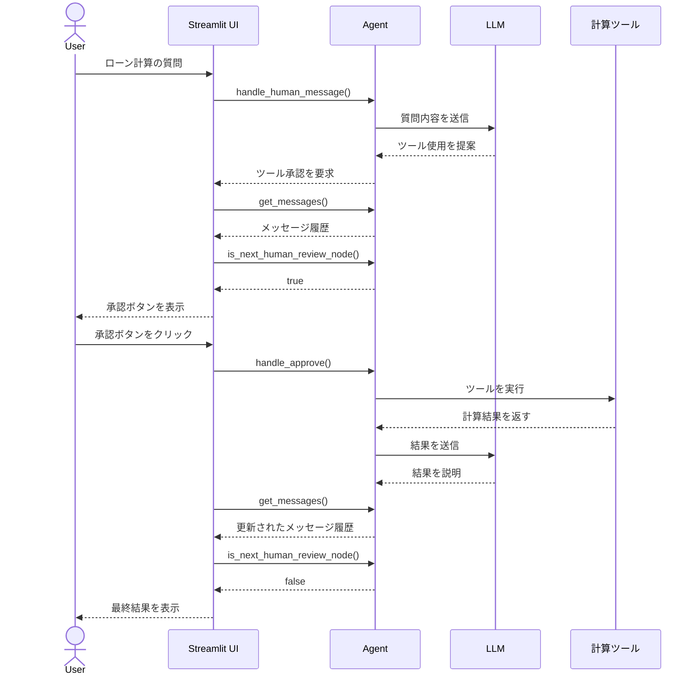

# human-in-the-loop3

LangGraphのHuman in the Loopの実装です。
StudyCoの勉強会の内容を写経したうえで、ツール部分の実装をファイナンス系の計算に変更しています。


##　起動方法

```bash
uv run streamlit run app.py
```

## 画面操作イメージ

```bash
年利2.4%で30万円を36回払いするとどうなる？
```


## インタラクションの流れ

### 通常の質問応答の場合



### ツール使用時の承認フロー



これらのシーケンス図は、アプリケーションの主要なインタラクションフローを示しています：

1. get_messages(): 
   - 現在のスレッドの会話履歴を取得
   - UI更新のたびに呼び出され、最新の会話状態を表示

2. is_next_human_review_node():
   - 次のステップが人間の承認を必要とするかを判断
   - 承認ボタンの表示/非表示の制御に使用

これらの内部メソッドは、ユーザーインターフェースの状態管理と表示制御に重要な役割を果たしています。
