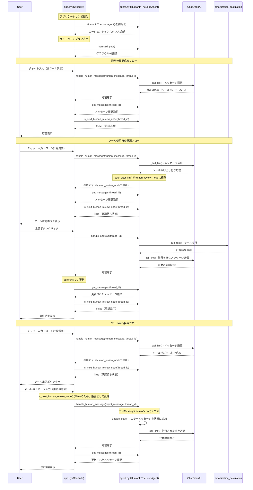

# app.py と agent.py のインタラクション

このドキュメントは、StreamlitアプリケーションとHuman-in-the-loopエージェント間の詳細なインタラクションフローを示します。

## 全体的なインタラクションシーケンス

## 重要なメソッドの詳細

### app.py側のメソッド

1. **show_messages(messages)**
   - HumanMessage、AIMessage、ToolMessageの種類に応じて表示を分岐
   - AIMessageにtool_callsがある場合、承認求む旨を表示

2. **app()メインループ**
   - エージェントの初期化とsession_stateでの管理
   - グラフの可視化（サイドバー）
   - メッセージ処理とUI更新

### agent.py側のメソッド

1. **handle_human_message(human_message, thread_id)**
   - 承認待ち状態でのメッセージはツール拒否として処理
   - graph.stream()でワークフローを実行

2. **handle_approve(thread_id)**
   - Command(resume="approve")でワークフロー再開

3. **is_next_human_review_node(thread_id)**
   - 状態の`next`フィールドをチェック
   - UI側の承認ボタン表示制御に使用

4. **get_messages(thread_id)**
   - 現在の会話履歴を取得
   - UI更新のたびに呼び出される

## 状態管理の流れ

- **thread_id**: セッション単位で会話を識別
- **StateSnapshot**: LangGraphの状態管理でcheckpointを保存
- **interrupt_before**: human_review_nodeで自動的に中断
- **MemorySaver**: 会話履歴を永続化